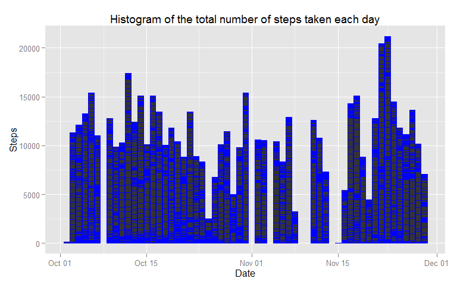
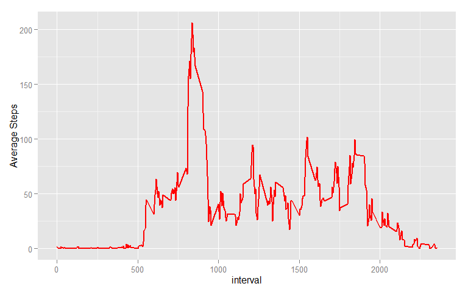
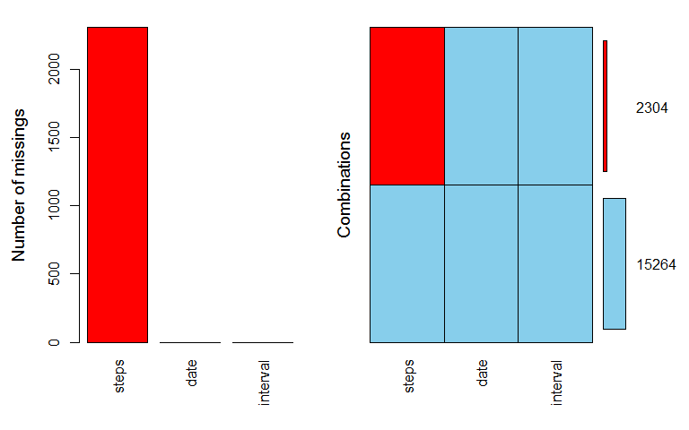
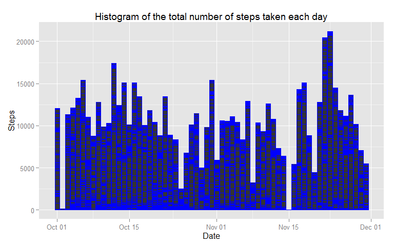
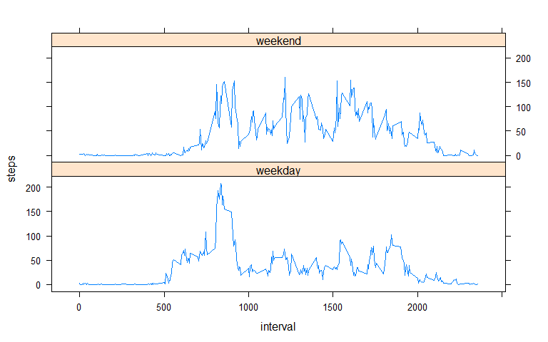

# Peer Assessment 1
Igor Tomashevskiy  
The dataset is stored in a comma-separated-value (CSV) file: activity.csv
The variables included in this dataset are:
steps: Number of steps taking in a 5-minute interval (missing values are coded as NA)  
date: The date on which the measurement was taken in YYYY-MM-DD format  
interval: Identifier for the 5-minute interval in which measurement was taken.    

**Data pre-processing**: 

```r
pa_data<-read.csv("activity.csv",colClasses=c("integer",'Date','integer'),na.strings="NA")
summary(pa_data)
```

```
##      steps             date               interval     
##  Min.   :  0.00   Min.   :2012-10-01   Min.   :   0.0  
##  1st Qu.:  0.00   1st Qu.:2012-10-16   1st Qu.: 588.8  
##  Median :  0.00   Median :2012-10-31   Median :1177.5  
##  Mean   : 37.38   Mean   :2012-10-31   Mean   :1177.5  
##  3rd Qu.: 12.00   3rd Qu.:2012-11-15   3rd Qu.:1766.2  
##  Max.   :806.00   Max.   :2012-11-30   Max.   :2355.0  
##  NA's   :2304
```
There are a total of 17,568 observations in this dataset. Number of records with missing values is 2304.  
**Mean total number of steps taken per day**  
New data set pa_data_agg will be created to calculate the mean and median of the total number of steps taken per day

```r
pa_data_agg<-aggregate(steps~date,pa_data,sum)
mean(pa_data_agg$steps)
```

```
## [1] 10766.19
```

```r
median(pa_data_agg$steps)
```

```
## [1] 10765
```
Mean Total Steps =10766  
Median Total Steps = 10765  


We will use the ggplot function to make a histogram of the total number of steps taken each day.


```r
library(ggplot2)
h1<-ggplot(pa_data,aes(date,steps))+geom_bar(stat="identity",binwidth=1,color='blue')+labs(title="Histogram of the total number of steps taken each day",x="Date",y="Steps")
print(h1)
```

```
## Warning: Removed 2304 rows containing missing values (position_stack).
```

 

**Average daily activity pattern**    
To answer the question about the average daily activity pattern we need to modify the dataset:

```r
daily_activity<-aggregate(steps~interval,pa_data,mean)
```
The code to produce the a time series plot:  


```r
t1<-ggplot(daily_activity,aes(interval,steps))+geom_line(color="red",size=1)+labs(y="Average Steps")
print(t1)
```

 

Next we will calculate the 5-minute interval that contains the maximum number of steps on average across all the days in the dataset.


```r
interval<-daily_activity[rev(order(daily_activity$steps)),]
head(interval,1)
```

```
##     interval    steps
## 104      835 206.1698
```

The 5 min intrval is 835  

**Imputing missing values**  
There are a number of days/intervals where there are missing values in the original data set The presence of missing days may introduce bias into some calculations or summaries of the data.  
The md.pattern() function in the mice package produces a tabulation of the missing data patterns.


```r
library(mice)
```

```
## Loading required package: Rcpp
## mice 2.25 2015-11-09
```

```r
md.pattern(pa_data)
```

```
##       date interval steps     
## 15264    1        1     1    0
##  2304    1        1     0    1
##          0        0  2304 2304
```
The second row describes the pattern with 'no missing values' except for steps. There are 2304 rows missing steps alone.
It is also easy to discern patterns visually.

```r
library(VIM)
```

```
## Loading required package: colorspace
## Loading required package: grid
## Loading required package: data.table
## VIM is ready to use. 
##  Since version 4.0.0 the GUI is in its own package VIMGUI.
## 
##           Please use the package to use the new (and old) GUI.
## 
## Suggestions and bug-reports can be submitted at: https://github.com/alexkowa/VIM/issues
## 
## Attaching package: 'VIM'
## 
## The following object is masked from 'package:datasets':
## 
##     sleep
```

```r
aggr(pa_data, prop=FALSE, numbers=TRUE)
```

 

A quick fix for the missing data is to replace them by the mean. However, it will underestimate the variance, disturb the relations between variables. Mean imputation should perhaps only be used as a fix when we have only  a handful of values missing. Our data set contains about 13% of records with missing data.
Better approach is to use mice package in R. By default, each varible with missing values is predicted from all other variables in the dataset. We will use the simple form of mice function with one dataset.


```r
impute_data<-pa_data
impute_data$num_date<-as.numeric(pa_data$date)
imp<-mice(impute_data[,c(1,3,4)],m=1,seed=123)
```

```
## 
##  iter imp variable
##   1   1  steps
##   2   1  steps
##   3   1  steps
##   4   1  steps
##   5   1  steps
```

```r
temp_data<-complete(imp)
colnames(temp_data)[1]<-"imp_steps"
impute_data<-cbind(impute_data,temp_data$imp_steps)
colnames(impute_data)[5]<-"imp_steps"
```

```r
h2<-ggplot(impute_data,aes(date,imp_steps))+geom_bar(stat="identity",binwidth=1,color='blue')+labs(title="Histogram of the total number of steps taken each day",x="Date",y="Steps")
print(h2)
```

 

```r
pa_data_agg<-aggregate(imp_steps~date,impute_data,sum)
mean(pa_data_agg$imp_steps)
```

```
## [1] 10491.95
```

```r
median(pa_data_agg$imp_steps)
```

```
## [1] 10571
```
**Activity patterns between weekdays and weekends**  

```r
library(lattice)
impute_data$day<-weekdays(impute_data$date)
impute_data$day[impute_data$day=="Saturday"|impute_data$day=="Sunday"]<-'weekend'
impute_data$day[impute_data$day!='weekend']<-'weekday'
impute_data$day<-as.factor(impute_data$day)
impute_data_agg<-aggregate(imp_steps~interval+day,data=impute_data,mean)
xyplot(imp_steps~interval|day,impute_data_agg,type='l',layout=c(1,2))
```

 


